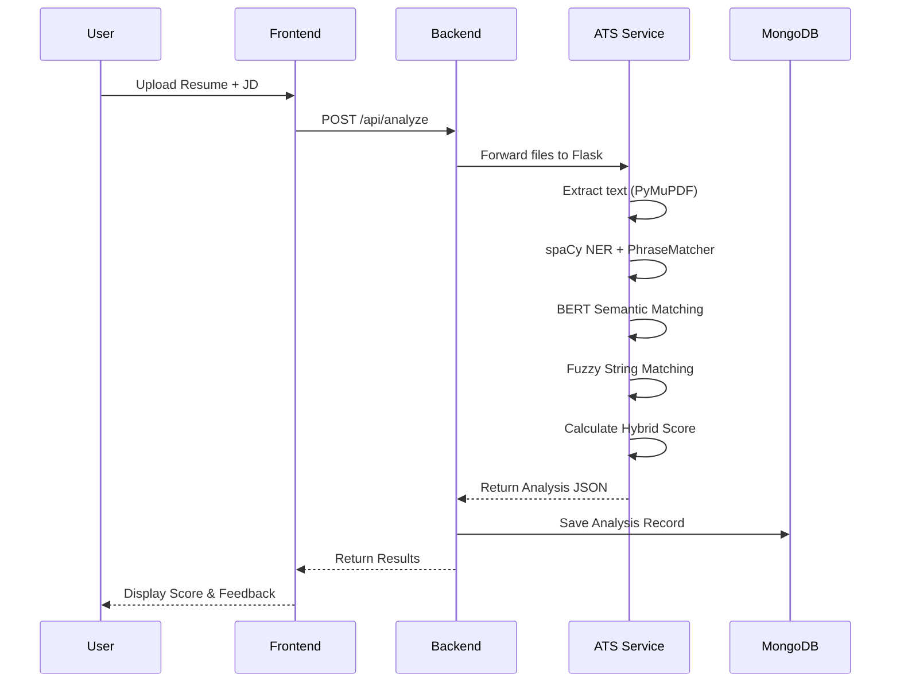
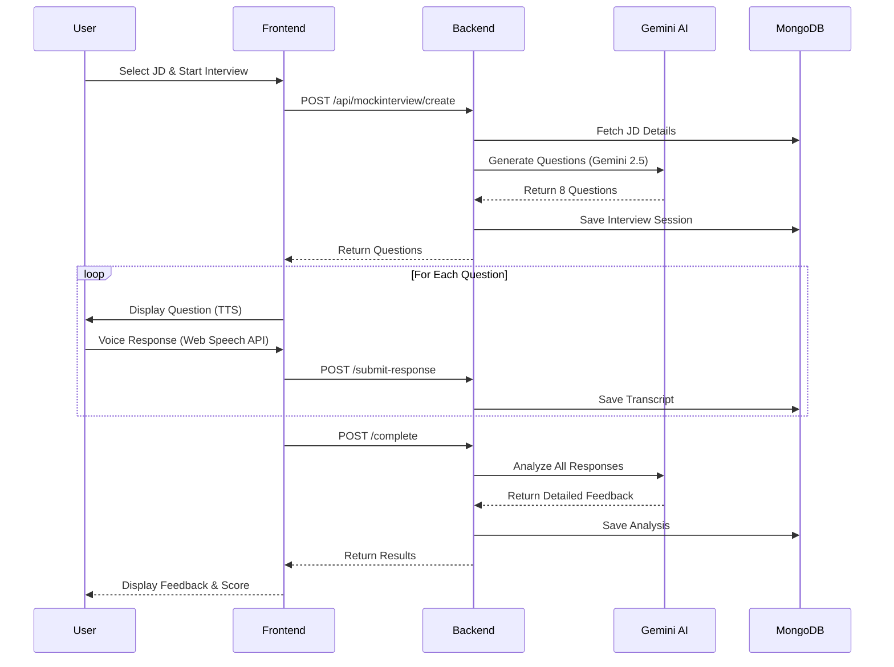
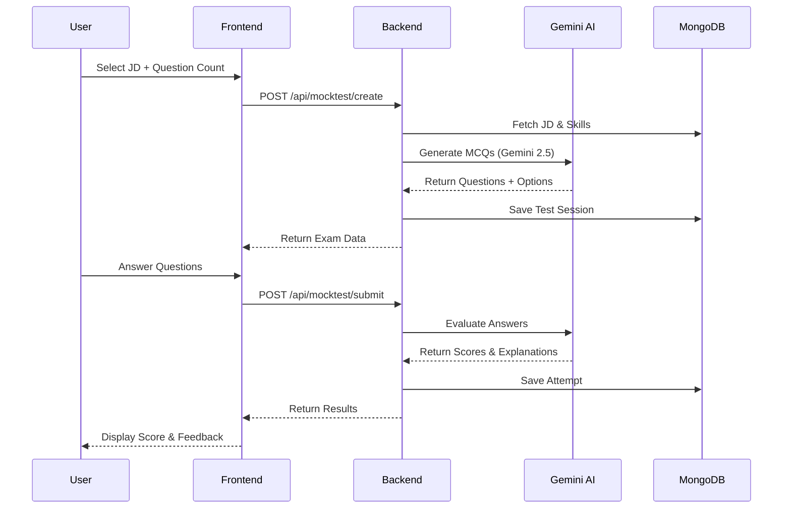
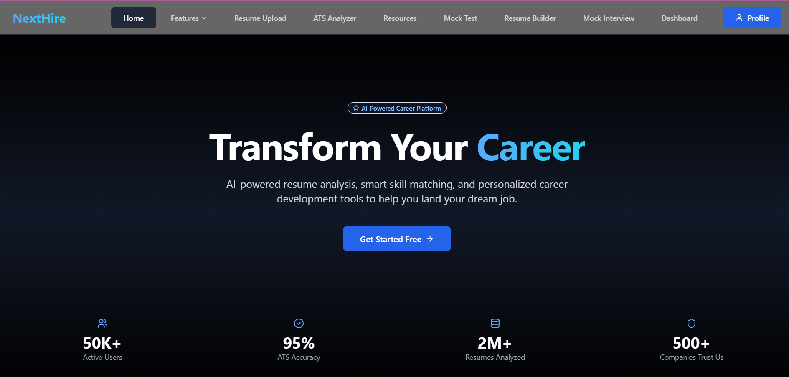

<div align="center">

# 🚀 NextHire

### AI-Powered Career Preparation Platform

[](https://reactjs.org/)
[](https://nodejs.org/)
[](https://python.org/)
[](https://mongodb.com/)
[](LICENSE)

[Features](#-features) • [Architecture](#-system-architecture) • [Installation](#-installation) • [API Reference](#-api-reference) • [Deployment](#-deployment)

</div>

---

## 📖 Overview

**NextHire** is an intelligent, end-to-end career preparation platform that leverages AI/ML to help job seekers optimize their resumes, practice for interviews, and ace technical assessments. The platform combines advanced NLP techniques with Google's Gemini AI to provide personalized feedback and recommendations.

### 🎯 Problem Statement

Job seekers often struggle with:
- Understanding what ATS (Applicant Tracking Systems) look for
- Identifying skill gaps between their resume and job requirements
- Preparing effectively for technical interviews
- Building ATS-friendly resumes

### 💡 Solution

NextHire addresses these challenges through:
- **Hybrid ATS Analysis**: Combines BERT embeddings with fuzzy matching for accurate skill extraction
- **AI Mock Interviews**: Gemini-powered interviews with real-time feedback
- **Smart Mock Tests**: Auto-generated assessments based on job descriptions
- **Resume Builder**: Multiple ATS-friendly templates with PDF export

---

## ✨ Features

| Feature | Description |
|---------|-------------|
| 📊 **ATS Resume Analyzer** | Hybrid scoring using BERT semantic similarity + fuzzy matching |
| 🎤 **AI Mock Interview** | Voice-enabled interviews with Gemini AI analysis |
| 📝 **Mock Assessments** | JD-based MCQ tests with detailed explanations |
| 📄 **Resume Builder** | 4 ATS-friendly templates with photo support & PDF export |
| 📚 **Learning Resources** | Curated resources via YouTube & Serper API |
| 📈 **Dashboard** | Track progress, scores, and interview history |
| 🔐 **Google OAuth** | Secure authentication with Google Sign-In |

---

## 🏗 System Architecture

```
┌─────────────────────────────────────────────────────────────────────────────┐
│                              NEXTHIRE PLATFORM                               │
├─────────────────────────────────────────────────────────────────────────────┤
│                                                                              │
│  ┌──────────────────┐    ┌──────────────────┐    ┌──────────────────┐      │
│  │                  │    │                  │    │                  │      │
│  │    FRONTEND      │    │    BACKEND       │    │   ATS SERVICE    │      │
│  │    (React)       │◄──►│   (Node.js)      │◄──►│   (Python)       │      │
│  │                  │    │                  │    │                  │      │
│  │  • Vite          │    │  • Express.js    │    │  • Flask         │      │
│  │  • Tailwind CSS  │    │  • Mongoose      │    │  • spaCy         │      │
│  │  • Framer Motion │    │  • JWT Auth      │    │  • Transformers  │      │
│  │  • Shadcn/UI     │    │  • Multer        │    │  • PyMuPDF       │      │
│  │                  │    │                  │    │                  │      │
│  └────────┬─────────┘    └────────┬─────────┘    └────────┬─────────┘      │
│           │                       │                       │                 │
│           │                       │                       │                 │
│           ▼                       ▼                       ▼                 │
│  ┌──────────────────────────────────────────────────────────────────┐      │
│  │                        EXTERNAL SERVICES                          │      │
│  ├──────────────┬──────────────┬──────────────┬─────────────────────┤      │
│  │   MongoDB    │  Gemini AI   │  Google      │   YouTube/Serper    │      │
│  │   Atlas      │  API         │  OAuth 2.0   │   APIs              │      │
│  └──────────────┴──────────────┴──────────────┴─────────────────────┘      │
│                                                                              │
└─────────────────────────────────────────────────────────────────────────────┘
```

---

## 🔄 Sequence Diagrams

### ATS Resume Analysis Flow



### Mock Interview Flow



### Mock Test Flow



---

## 🛠 Tech Stack

### Frontend
| Technology | Purpose |
|------------|---------|
| React 18 | UI Framework |
| Vite | Build Tool |
| Tailwind CSS | Styling |
| Framer Motion | Animations |
| Shadcn/UI | Component Library |
| Axios | HTTP Client |
| React Router | Navigation |
| Web Speech API | Voice Recognition/TTS |
| html2pdf.js | PDF Generation |

### Backend
| Technology | Purpose |
|------------|---------|
| Node.js | Runtime |
| Express.js | Web Framework |
| MongoDB | Database |
| Mongoose | ODM |
| JWT | Authentication |
| Multer | File Upload |
| Axios | API Calls |
| Google Auth | OAuth 2.0 |

### ATS Service (Python)
| Technology | Purpose |
|------------|---------|
| Flask | Web Framework |
| spaCy | NLP Processing |
| Sentence Transformers | BERT Embeddings |
| RapidFuzz | Fuzzy Matching |
| PyMuPDF | PDF Parsing |
| scikit-learn | Cosine Similarity |
| Transformers | NER Models |

### External APIs
| Service | Purpose |
|---------|---------|
| Google Gemini 2.5 | AI Question Generation & Analysis |
| YouTube Data API | Learning Resources |
| Serper API | Web Search for Resources |
| Google OAuth | User Authentication |

---

## 📁 Project Structure

```
nexthire/
├── frontend/                    # React Frontend
│   ├── src/
│   │   ├── components/ui/       # Shadcn UI Components
│   │   ├── pages/              # Page Components
│   │   │   ├── Home.jsx
│   │   │   ├── Login.jsx
│   │   │   ├── AtsAnalysis.jsx
│   │   │   ├── MockTest.jsx
│   │   │   ├── MockInterview.jsx
│   │   │   ├── ResumeBuilder.jsx
│   │   │   ├── Resources.jsx
│   │   │   └── Dashboard.jsx
│   │   ├── styles/             # CSS Styles
│   │   └── App.jsx             # Main App
│   └── package.json
│
├── backend/                     # Node.js Backend
│   ├── Controllers/
│   │   ├── analyzeController.js
│   │   ├── mockTestController.js
│   │   ├── mockInterviewController.js
│   │   └── resumeController.js
│   ├── models/
│   │   ├── User.js
│   │   ├── JD.js
│   │   ├── MockTest.js
│   │   ├── MockInterview.js
│   │   └── Resume.js
│   ├── routes/
│   ├── middleware/
│   └── index.js
│
├── ats-skill-analyzer/          # Python ATS Service
│   ├── app/
│   │   ├── main.py             # Flask App
│   │   ├── extractor.py        # Skill Extraction
│   │   ├── matcher.py          # Skill Matching
│   │   ├── semantic_matcher.py # BERT Matching
│   │   └── data/               # Skill Datasets
│   ├── requirements.txt
│   └── run.py
│
└── README.md
```

---

## ⚙️ Installation

### Prerequisites

- Node.js 18+ 
- Python 3.10+
- MongoDB (local or Atlas)
- Google Cloud Console account (for OAuth)
- Gemini API key

### 1️⃣ Clone Repository

```bash
git clone https://github.com/tharun2107/nexthire.git
cd nexthire
```

### 2️⃣ Setup Backend

```bash
cd backend
npm install
```

Create `.env` file:
```env
MONGO_URI=mongodb+srv://your-connection-string
JWT_SECRET=your-jwt-secret
GOOGLE_CLIENT_ID=your-google-client-id
GOOGLE_CLIENT_SECRET=your-google-client-secret
GEMINI_API_KEY=your-gemini-api-key
ATS_SERVICE_URL=http://localhost:5000
```

Start backend:
```bash
node index
# Server runs on http://localhost:5001
```

### 3️⃣ Setup ATS Service

```bash
cd ats-skill-analyzer
python -m venv venv
venv\Scripts\activate  # Windows
# source venv/bin/activate  # Mac/Linux

pip install -r requirements.txt
python -m spacy download en_core_web_sm
```

Start ATS service:
```bash
python app/main.py
# Server runs on http://localhost:5000
```

### 4️⃣ Setup Frontend

```bash
cd frontend
npm install
```

Create `.env` file:
```env
VITE_API_URL=http://localhost:5001
VITE_GOOGLE_CLIENT_ID=your-google-client-id
```

Start frontend:
```bash
npm run dev
# App runs on http://localhost:5173
```

---

## 📡 API Reference

### Authentication
| Endpoint | Method | Description |
|----------|--------|-------------|
| `/auth/google` | POST | Google OAuth login |

### ATS Analysis
| Endpoint | Method | Description |
|----------|--------|-------------|
| `/api/analyze` | POST | Analyze resume against JD |
| `/api/jd` | POST | Create new JD |
| `/api/jd` | GET | Get all JDs |

### Mock Test
| Endpoint | Method | Description |
|----------|--------|-------------|
| `/api/mocktest/create` | POST | Generate new test |
| `/api/mocktest/submit` | POST | Submit test answers |
| `/api/mocktest/history` | GET | Get test history |

### Mock Interview
| Endpoint | Method | Description |
|----------|--------|-------------|
| `/api/mockinterview/create` | POST | Start new interview |
| `/api/mockinterview/submit-response` | POST | Submit answer |
| `/api/mockinterview/complete` | POST | Complete & get analysis |
| `/api/mockinterview/history` | GET | Get interview history |

### Resume
| Endpoint | Method | Description |
|----------|--------|-------------|
| `/api/resume/create` | POST | Save resume |
| `/api/resume` | GET | Get all resumes |
| `/api/resume/:id` | GET | Get resume by ID |
| `/api/resume/update/:id` | PUT | Update resume |
| `/api/resume/delete/:id` | DELETE | Delete resume |

---

## 🚀 Deployment

### Architecture for Production

```
┌─────────────┐     ┌─────────────┐     ┌─────────────┐
│   Vercel    │     │   Render    │     │   Render    │
│  (Frontend) │────▶│  (Backend)  │────▶│ (ATS/Python)│
└─────────────┘     └─────────────┘     └─────────────┘
                           │
                           ▼
                    ┌─────────────┐
                    │  MongoDB    │
                    │   Atlas     │
                    └─────────────┘
```

### Deploy Frontend (Vercel)

```bash
cd frontend
vercel --prod
```

### Deploy Backend (Render)

1. Create Web Service on Render
2. Connect GitHub repository
3. Set root directory: `backend`
4. Build command: `npm install`
5. Start command: `node index.js`
6. Add environment variables

### Deploy ATS Service (Render)

1. Create Web Service on Render
2. Set root directory: `ats-skill-analyzer`
3. Build command: `pip install -r requirements.txt && python -m spacy download en_core_web_sm`
4. Start command: `gunicorn -w 2 -b 0.0.0.0:$PORT run:app`

---

## 📸 Screenshots

<div align="center">

| Home Page | Login Page |
|:---------:|:----------:|
|  |  |

| ATS Analysis | Mock Interview |
|:------------:|:--------------:|
|  |  |

| Resume Builder | Dashboard |
|:--------------:|:---------:|
|  |  |

</div>

---

## 🤝 Contributing

Contributions are welcome! Please follow these steps:

1. Fork the repository
2. Create a feature branch (`git checkout -b feature/AmazingFeature`)
3. Commit changes (`git commit -m 'Add AmazingFeature'`)
4. Push to branch (`git push origin feature/AmazingFeature`)
5. Open a Pull Request

### Code Style
- Frontend: ESLint + Prettier
- Backend: Standard Node.js conventions
- Python: PEP 8

---

## 📝 License

This project is licensed under the MIT License - see the [LICENSE](LICENSE) file for details.

---

## 👨‍💻 Author

**Tharun Kudikyala**

- GitHub: [@tharun2107](https://github.com/tharun2107)
- LinkedIn: [Tharun Kudikyala](https://linkedin.com/in/tharun-kudikyala)
- Email: tharunkudikyala@gmail.com

---

<div align="center">

### ⭐ Star this repo if you found it helpful!

Made with ❤️ by Tharun

</div>
